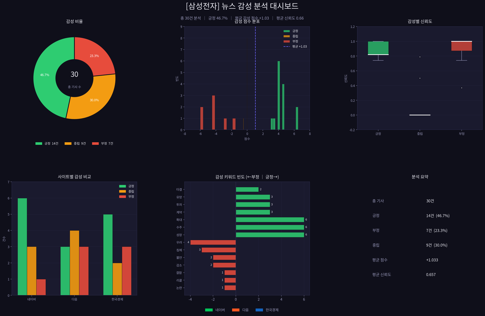

# 📊 News Sentiment Insight Dashboard (뉴스 감성 분석 대시보드)

이 프로젝트는 특정 키워드에 대한 뉴스 기사를 자동으로 수집하고, 감성 분석(Sentiment Analysis)을 통해 여론의 흐름을 한눈에 파악할 수 있는 시각화 대시보드를 제공합니다.


## 🎯 프로젝트 목적
- **여론 모니터링**: 특정 브랜드, 기업, 정책 등에 대한 뉴스 반응 실시간 확인
- **데이터 기반 의사결정**: 뉴스 텍스트를 정량적인 감성 점수로 변환하여 트렌드 분석
- **자동화된 보고서**: 크롤링부터 시각화, 엑셀 저장까지 전 과정 자동화

## 🛠 기술 스택
- **Language**: Python 3.x
- **Crawling**: Selenium, Webdriver-manager
- **Data Analysis**: Pandas, Numpy
- **Sentiment Analysis**: Lexicon-based Custom Analyzer
- **Visualization**: Matplotlib, Seaborn
- **Data Export**: Openpyxl (Excel)

## ✨ 핵심 기능
1. **멀티 사이트 크롤링**: 네이버 뉴스, 한국경제 등 주요 뉴스 사이트에서 키워드 기반 기사 수집
2. **감성 분석 엔진**: 자체 정의된 감성 사전을 기반으로 긍정/부정/중립 점수 계산 및 분류
3. **통합 대시보드 시각화**: 
   - 감성 분포 (Pie Chart)
   - 사이트별 감성 비교 (Bar Chart)
   - 주요 키워드 분석
   - 감성 트렌드 요약
4. **데이터 엑셀 저장**: 분석된 원본 데이터를 타임스탬프와 함께 엑셀 파일로 자동 저장

## 🚀 설치 및 실행 방법

### 1. 환경 설정
Python이 설치된 환경에서 필요한 라이브러리를 설치합니다.
```bash
pip install -r requirements.txt
```

### 2. 실행
`main.py`를 실행하여 분석을 시작합니다. (기본 설정: '삼성전자' 키워드 분석)
```bash
python main.py
```

### 3. 결과 확인
- **시각화 결과**: `dashboard.png` 또는 `dashboard_multisite.png` 파일로 저장됩니다.
- **데이터 결과**: `[키워드]_감성분석_[날짜].xlsx` 파일로 저장됩니다.

## 📸 스크린샷
### 멀티 사이트 분석 대시보드


### 단일 사이트 분석 결과 예시

